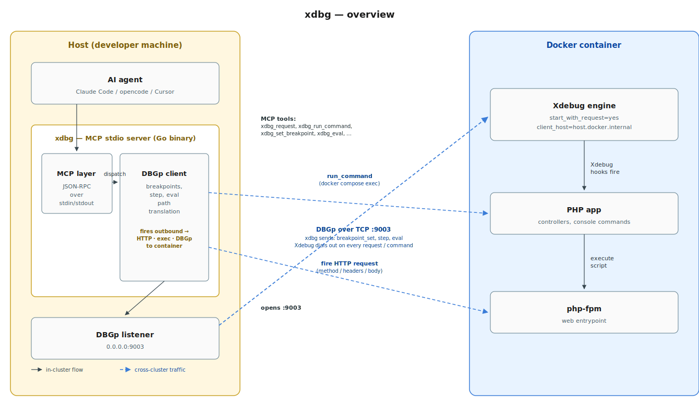

# xdbg — let AI debug your PHP, live in Docker

You run PHP in Docker. A bug shows up in an API endpoint — a POST with a JSON
body and an `Authorization: Bearer …` header. You open PhpStorm, click
"listen for debug connections", fire a request from Postman, hit the
breakpoint, step, inspect, eval, fix. Now imagine doing all of that **without
leaving the chat** — you describe the bug to Claude Code, opencode, Cursor, or
any MCP-aware agent, and the agent debugs it for you: sets the breakpoint,
fires the real request, reads the stack, inspects variables, steps, evals,
proposes a fix. That's xdbg.

**xdbg is an MCP server that connects to Xdebug running in a Docker container
and exposes it as tools** — so any AI agent that speaks MCP (Claude Code,
opencode, Cursor) can fire HTTP requests (`curl`-style) and run CLI commands
inside the container, then drive the resulting debug session: breakpoints,
stack, variables, eval, stepping. All from the chat.

## Why not PhpStorm's MCP tools?

PhpStorm ships its own Xdebug MCP tools, but they only fire **GET** requests
and don't let you set **headers** (cookies, auth tokens, `Content-Type`). For
real API work — POST/PUT/PATCH with JSON bodies and JWT/auth headers — you end
up juggling port forwards and a second terminal. xdbg closes that gap: the
same MCP-driven flow, but with full control over method, headers, and body,
plus CLI/Symfony command debugging and host↔container path translation.

## What it solves

| Pain | Before | With xdbg |
|---|---|---|
| **AI can't debug POST/PUT/PATCH** | PhpStorm MCP = GET only | `xdbg_request` takes `method`, `headers`, `body` |
| **Auth / cookies / JWT** | Nowhere to put the header | Pass `headers: {"Authorization": "Bearer …"}` (or read from a file to keep secrets out of the chat) |
| **CLI / Symfony commands** | No MCP path at all | `xdbg_run_command "bin/console app:foo"` pauses at the breakpoint |
| **Host ↔ container paths** | Breakpoints need container paths; stacks show container paths | Set breakpoints with host paths; stacks come back as host paths |
| **Port conflicts** | Two debuggers fight over 9003 | Detects the holder (lsof), waits its turn, tells you who's blocking |

## How it works (30-second version)

1. The container's Xdebug is a DBGp *engine*. With
   `xdebug.start_with_request=yes` it dials **out** to
   `host.docker.internal:9003` on every request and waits for commands.
2. `xdbg` listens on `0.0.0.0:9003` and drives the engine — set breakpoints,
   step, eval, read the stack.
3. The MCP server is one long-lived process, so the session survives across
   tool calls. Your agent sets a breakpoint, fires the request, inspects
   variables, steps — all in one conversation.



(Hand-drawn SVG — edit `docs/xdbg-overview.svg` directly if you need
to tweak layout.)

For the full request round-trip with step-by-step sequence, see the
[architecture diagram](docs/xdbg-architecture.svg) ([source](docs/architecture.puml)).

## Install

### `go install` (recommended — one line, no clone)

```bash
go install github.com/crazy-goat/xdbg@latest
```

This puts `xdbg` in `$(go env GOPATH)/bin` (default `~/go/bin`).
Add it to your `PATH` (one-time):

```bash
export PATH="$(go env GOPATH)/bin:$PATH"   # add to ~/.zshrc / ~/.bashrc
```

Verify: `xdbg --help`.

### From a local clone

```bash
git clone https://github.com/crazy-goat/xdbg.git
cd xdbg
make install          # builds and copies to ~/.local/bin/xdbg
```

(`make build` produces `./xdbg` without installing.)

### Prerequisites

- Go 1.21+ (only needed for `go install` / `make`)
- Docker (or any container runtime) running your PHP app
- Xdebug installed **inside** the container (the engine), enabled on demand

## Configure

xdbg is an MCP **stdio** server: the agent spawns it as a child process and
talks JSON-RPC over stdin/stdout. You register it once in your agent's MCP
config.

### opencode

Add an entry under `mcp` in `~/.config/opencode/opencode.json` (or your
project's `opencode.json`):

```jsonc
{
  "mcp": {
    "xdbg": {
      "enabled": true,
      "type": "local",
      "command": [
        "xdbg", "mcp",
        "--dbg-port", "9003",
        "--local-root",  "/Users/you/work/your-app",
        "--docker-root", "/var/www/your-app",
        "--xdebug-enable-cmd",  "docker compose exec -T php set-xdebug-on",
        "--xdebug-disable-cmd", "docker compose exec -T php set-xdebug-off",
        "--xdebug-status-cmd",  "docker compose exec -T php get-xdebug-status",
        "--container-exec",      "docker compose exec -T php"
      ]
    }
  }
}
```

Restart opencode (or reconnect MCP). Tools appear as `xdbg_xdbg_*`.

### Claude Code (`.mcp.json`)

Drop a `.mcp.json` in your project root (or `~/.claude.json` for global):

```json
{
  "mcpServers": {
    "xdbg": {
      "command": "xdbg",
      "args": [
        "mcp",
        "--dbg-port", "9003",
        "--local-root",  "/Users/you/work/your-app",
        "--docker-root", "/var/www/your-app",
        "--xdebug-enable-cmd",  "docker compose exec -T php set-xdebug-on",
        "--xdebug-disable-cmd", "docker compose exec -T php set-xdebug-off",
        "--xdebug-status-cmd",  "docker compose exec -T php get-xdebug-status",
        "--container-exec",      "docker compose exec -T php"
      ]
    }
  }
}
```

Reconnect MCP in Claude Code. Tools appear as `mcp__xdbg__xdbg_*`.

### Flags reference

| Flag | Default | Purpose |
|---|---|---|
| `--dbg-port` | `9003` | Port Xdebug dials into (the listener binds `0.0.0.0:<port>`) |
| `--local-root` | — | Host project root (for path translation) |
| `--docker-root` | — | Container project root (for path translation) |
| `--xdebug-enable-cmd` | — | Shell command to enable Xdebug in the container |
| `--xdebug-disable-cmd` | — | Shell command to disable Xdebug in the container |
| `--xdebug-status-cmd` | — | Shell command to check Xdebug status in the container |
| `--container-exec` | `docker compose exec -T php` | Prefix for running CLI commands inside the container |


### Let the agent toggle Xdebug for you

Xdebug should be off by default for performance. When you configure
`--xdebug-enable-cmd`, `--xdebug-disable-cmd` and `--xdebug-status-cmd`, the
agent gets three MCP tools — `xdbg_container_enable`, `xdbg_container_disable`
and `xdbg_container_status` — and can turn Xdebug on only for the debug
session, then off again when it's done. No shell access, no manual steps —
the agent handles the full lifecycle itself.

## Tools (`xdbg_*`)

### `xdbg_status()`
Returns the current debugger state (`no session`, `started`, `break`,
`stopping`), the file and line where execution is paused (or `-` when not
paused), and the number of queued breakpoints. Use it as the first call
after firing a request or running a command to see whether the session was
adopted and where the engine stopped. It's safe to call any time, with or
without an active session. It does not advance execution or mutate state.

### `xdbg_set_breakpoint(string file, int line)`
`file` is a host path (absolute or project-relative, auto-translated to the
container path); `line` is 1-based. Sets a line breakpoint. If a session is
already active, the breakpoint is applied immediately and its engine-assigned
id is returned. If no session is active, the breakpoint is queued and applied
automatically on the next session (the next `xdbg_request` or
`xdbg_run_command`). Multiple breakpoints can be set before triggering the
request; all of them are applied when the engine connects.

### `xdbg_breakpoint_list()`
Lists all breakpoints known to the engine, with their ids, state
(`enabled`/`disabled`), file (translated back to a host path) and line. When
no session is active, lists the queued breakpoints instead. Use it to verify
what's armed before firing a request. Safe to call any time.

### `xdbg_breakpoint_remove(string id)`
`id` is the breakpoint id returned by `xdbg_set_breakpoint` or shown by
`xdbg_breakpoint_list`. Removes a single breakpoint — both from the engine
(if a session is active) and from the local queue. Returns `removed <id>` on
success. Call `xdbg_breakpoint_list` first to find the id.

### `xdbg_breakpoint_clear()`
Removes every breakpoint: queued (not yet applied) and applied (active in
the engine). Safe to call with or without an active session. Use it to reset
state between debugging scenarios. Returns the number of breakpoints cleared.

### `xdbg_request(string url, string? method, map<string,string>? headers, string? body, int? timeoutMs)`
`url` is required; `method` defaults to `GET`; `headers` is an object of
string→string; `body` is a raw string; `timeoutMs` defaults to 15000. Fires
an HTTP request at the app with full control over method, headers, and body.
Because the container has `xdebug.start_with_request=yes`, the request makes
php-fpm dial the DBGp port; xdbg adopts the connection, applies queued
breakpoints, and pauses at the first break. When no breakpoints are set, the
script runs to completion and the request returns. To debug interactively,
set breakpoints first, then call `xdbg_request` — the tool returns once the
session is paused, and you drive it with `xdbg_run` / `xdbg_step_*` / etc.

### `xdbg_request_from_files(string url, string? method, string? headers_file, string? body_file, int? timeoutMs)`
`url` is required; `headers_file` is a path to a file with `Name: Value`
lines (blank lines and `#` comments ignored — or a JSON object); `body_file`
is a path to raw body bytes; `timeoutMs` defaults to 15000. Like
`xdbg_request` but reads headers and body from disk. Use it when headers
contain sensitive values (JWT tokens, cookies, API keys) that should not
appear inline in the chat or tool arguments. The files are read once, at
call time.

### `xdbg_listen(int? timeoutMs)`
`timeoutMs` defaults to 30000. Arms the DBGp listener and blocks until the
next engine connection is adopted, then returns. Use it for CLI / Symfony
command debugging: call `xdbg_listen` first, then launch the command
separately (e.g. `docker compose exec -T php php bin/console app:cmd`). Once
the tool returns, the session is paused at the script start with breakpoints
applied — drive it with `xdbg_run` / `xdbg_step_*` / etc. If no engine
connects within the timeout, returns an error.

### `xdbg_run_command(string command, int? timeoutMs)`
`command` is required (e.g. `"bin/console app:my-command --option=value"`);
`timeoutMs` defaults to 30000. Runs the command inside the container (prefixed
with `--container-exec`) and waits for the resulting Xdebug connection. When
no breakpoints are set, the script runs to completion and the command output
is returned. When breakpoints are set, the session pauses at the first break
and the caller drives it with `xdbg_run` / `xdbg_step_*` — the command output
is not available until the script finishes. This is the CLI equivalent of
`xdbg_request`.

### `xdbg_run()`
Resumes execution after a break — the engine runs until the next breakpoint
or until the script finishes. Returns the new state (`break`/`stopping`) and
the current location. When the script finishes, the state becomes `stopping`
and the response notes `(script finished)`. Call it repeatedly to step
through breakpoints.

### `xdbg_step_into()`
Steps into the next line — if the next line is a function call, execution
pauses at the first line inside the called function. Returns the new state
and location. Use it to follow execution into callees. When there's nothing
to step into, behaves like `xdbg_step_over`.

### `xdbg_step_over()`
Steps over the next line — if the line is a function call, the function runs
to completion and execution pauses on the next line of the caller. Returns
the new state and location. Use it to advance without descending into
callees.

### `xdbg_step_out()`
Steps out of the current function — execution runs until the current
function returns, then pauses at the caller. Returns the new state and
location. Use it to escape a function you stepped into by mistake.

### `xdbg_pause()`
Breaks (pauses) execution immediately, as if a breakpoint were hit at the
current line. Returns the new state (`break`) and location. Use it to
interrupt a long-running `xdbg_run` and regain control. Only meaningful while
a session is active and running.

### `xdbg_stack()`
Returns the call stack at the current pause point, with each frame's depth,
function name, file (translated to a host path) and line. Returns
`(no stack — not paused?)` when no session is paused. Use it to understand
how you got to the current location. Safe to call any time, but only
meaningful while paused.

### `xdbg_context(int? stackDepth)`
`stackDepth` defaults to 0 (the top frame). Returns the variables in scope
at the given stack frame, with their names, types, and a summarized value.
Use it to inspect the local state at the current pause point. For nested
values, the summary shows the type and child count (e.g.
`object {3 children}`) — use `xdbg_property_get` to drill in.

### `xdbg_eval(string expression)`
`expression` is a PHP expression (e.g. `$foo->bar()` or `count($items)`).
Evaluates the expression in the current scope and returns the result. Use it
to test hypotheses, call methods, inspect computed values, or probe framework
state. The expression is base64-encoded and sent via the DBGp `eval` command.
Returns an error if the expression throws.

### `xdbg_property_get(string name, int? stackDepth)`
`name` is a variable name (e.g. `$foo`); `stackDepth` defaults to 0. Returns
the value of one variable or property in the given stack frame. Use it to
drill into a variable you saw in `xdbg_context` — for nested structures, it
returns the child properties. Returns `(not found)` when the name doesn't
exist in scope.

### `xdbg_property_set(string name, string value)`
`name` is a variable name; `value` is a PHP literal (e.g. `"bar"` or `42`).
Sets the variable to the given value in the current scope. Use it to test how
the code behaves with different inputs without editing the source. The value
is base64-encoded and sent via the DBGp `property_set` command. Returns
`<name> = <value>` on success.

### `xdbg_detach()`
Detaches from the engine: lets the script finish on its own and drops the
session. The DBGp listener closes, freeing port 9003. Use it when you're done
debugging but want the request/command to complete normally. Returns
`detached`.

### `xdbg_stop()`
Stops the debugged script immediately — the engine terminates the PHP
process and the session ends. The listener closes, freeing port 9003. Use it
to abort a stuck request or command. Returns `stopped`.

### `xdbg_container_status()` / `xdbg_container_enable()` / `xdbg_container_disable()`
No arguments. Available only when the corresponding `--xdebug-*-cmd` flag is
configured. `_status` runs the status command and returns its output (e.g.
whether Xdebug is currently on or off). `_enable` / `_disable` run the
enable/disable commands to toggle Xdebug in the container at runtime, so the
agent can turn it on for a debug session and off again afterwards without
shell access.

## Typical flows

**Web (POST/GET/…)** — the tool fires the request itself:

1. `xdbg_container_status` — check Xdebug is enabled in the container
2. `xdbg_container_enable` — turn it on if it's off
3. `xdbg_set_breakpoint` `{file:"src/.../FooController.php", line:42}`
4. `xdbg_request` `{url:"http://127.0.0.1:8090/api/foo", method:"POST", headers:{"Content-Type":"application/json","Authorization":"Bearer …"}, body:"{…}"}` → breaks at `FooController:42`
5. `xdbg_stack` / `_context` / `_eval` / `_step_*` / `_run` — inspect and step
6. `xdbg_detach` or `xdbg_stop` — end the session and free port 9003
7. `xdbg_container_disable` — turn Xdebug off (restore container performance)

**CLI / Symfony command (manual launch):**

1. `xdbg_container_status` — check Xdebug is enabled in the container
2. `xdbg_container_enable` — turn it on if it's off
3. `xdbg_set_breakpoint` …
4. `xdbg_listen` (arms; returns when the engine connects)
5. launch separately: `docker compose exec -T php php bin/console app:cmd`
6. drive with `_run` / `_step_*` / `_stack` / `_context` / `_eval`
7. `xdbg_detach` or `xdbg_stop` — end the session and free port 9003
8. `xdbg_container_disable` — turn Xdebug off (restore container performance)

**CLI / Symfony command (agent-driven):**

1. `xdbg_container_status` — check Xdebug is enabled in the container
2. `xdbg_container_enable` — turn it on if it's off
3. `xdbg_set_breakpoint` …
4. `xdbg_run_command` `{command:"bin/console app:my-command --option=value"}` → pauses at the breakpoint
5. `xdbg_stack` / `_context` / `_eval` / `_step_*` / `_run` — inspect and step
6. `xdbg_detach` or `xdbg_stop` — end the session and free port 9003
7. `xdbg_container_disable` — turn Xdebug off (restore container performance)

## License

MIT — see [LICENSE](LICENSE).