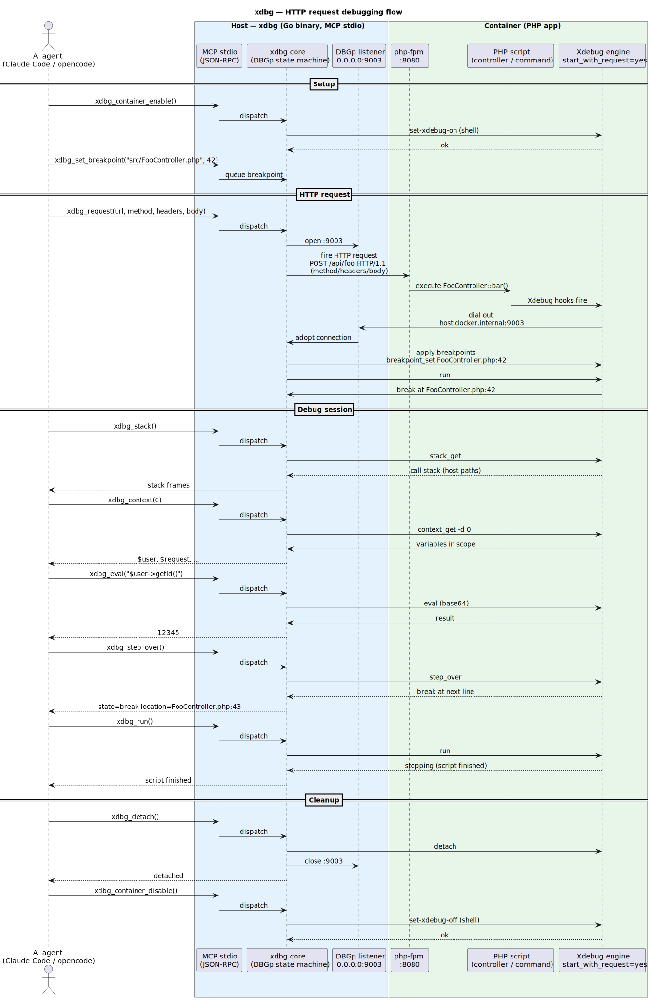

# xdbg — let AI debug your PHP, live in Docker

You run PHP in Docker. A bug shows up in an API endpoint — a POST with a JSON
body and an `Authorization: Bearer …` header. You open PhpStorm, click
"listen for debug connections", fire a request from Postman, hit the
breakpoint, step, inspect, eval, fix. Now imagine doing all of that **without
leaving the chat** — you describe the bug to Claude Code, opencode, Cursor, or
any MCP-aware agent, and the agent debugs it for you: sets the breakpoint,
fires the real request, reads the stack, inspects variables, steps, evals,
proposes a fix. That's xdbg.

**xdbg is an MCP server that connects to Xdebug running in a Docker container
and exposes it as tools** — so any AI agent that speaks MCP (Claude Code,
opencode, Cursor) can fire HTTP requests (`curl`-style) and run CLI commands
inside the container, then drive the resulting debug session: breakpoints,
stack, variables, eval, stepping. All from the chat.

## Why not PhpStorm's MCP tools?

PhpStorm ships its own Xdebug MCP tools, but they only fire **GET** requests
and don't let you set **headers** (cookies, auth tokens, `Content-Type`). For
real API work — POST/PUT/PATCH with JSON bodies and JWT/auth headers — you end
up juggling port forwards and a second terminal. xdbg closes that gap: the
same MCP-driven flow, but with full control over method, headers, and body,
plus CLI/Symfony command debugging and host↔container path translation.

## What it solves

| Pain | Before | With xdbg |
|---|---|---|
| **AI can't debug POST/PUT/PATCH** | PhpStorm MCP = GET only | `xdbg_request` takes `method`, `headers`, `body` |
| **Auth / cookies / JWT** | Nowhere to put the header | Pass `headers: {"Authorization": "Bearer …"}` (or read from a file to keep secrets out of the chat) |
| **CLI / Symfony commands** | No MCP path at all | `xdbg_run_command "bin/console app:foo"` pauses at the breakpoint |
| **Host ↔ container paths** | Breakpoints need container paths; stacks show container paths | Set breakpoints with host paths; stacks come back as host paths |
| **Port conflicts** | Two debuggers fight over 9003 | Detects the holder (lsof), waits its turn, tells you who's blocking |

## How it works (30-second version)

1. The container's Xdebug is a DBGp *engine*. With
   `xdebug.start_with_request=yes` it dials **out** to
   `host.docker.internal:9003` on every request and waits for commands.
2. `xdbg` listens on `0.0.0.0:9003` and drives the engine — set breakpoints,
   step, eval, read the stack.
3. The MCP server is one long-lived process, so the session survives across
   tool calls. Your agent sets a breakpoint, fires the request, inspects
   variables, steps — all in one conversation.



([source](docs/architecture.puml) — edit with PlantUML)

## Install

### From source (recommended)

```bash
git clone https://github.com/crazy-goat/xdbg.git
cd xdbg
make install          # builds and copies to ~/.local/bin/xdbg
```

Make sure `~/.local/bin` is on your `PATH`:

```bash
export PATH="$HOME/.local/bin:$PATH"   # add to ~/.zshrc / ~/.bashrc
```

Verify:

```bash
xdbg --help
```

### Build without installing

```bash
make build            # -> ./xdbg
./xdbg --help
```

### Prerequisites

- Go 1.21+ (only needed for building from source)
- Docker (or any container runtime) running your PHP app
- Xdebug installed **inside** the container (the engine), enabled on demand

## Configure

xdbg is an MCP **stdio** server: the agent spawns it as a child process and
talks JSON-RPC over stdin/stdout. You register it once in your agent's MCP
config.

### opencode

Add an entry under `mcp` in `~/.config/opencode/opencode.json` (or your
project's `opencode.json`):

```jsonc
{
  "mcp": {
    "xdbg": {
      "enabled": true,
      "type": "local",
      "command": [
        "xdbg",
        "--dbg-port", "9003",
        "--local-root",  "/Users/you/work/your-app",
        "--docker-root", "/var/www/your-app",
        "--xdebug-enable-cmd",  "docker compose exec -T php set-xdebug-on",
        "--xdebug-disable-cmd", "docker compose exec -T php set-xdebug-off",
        "--xdebug-status-cmd",  "docker compose exec -T php get-xdebug-status",
        "--container-exec",      "docker compose exec -T php"
      ]
    }
  }
}
```

Restart opencode (or reconnect MCP). Tools appear as `xdbg_xdbg_*`.

### Claude Code (`.mcp.json`)

Drop a `.mcp.json` in your project root (or `~/.claude.json` for global):

```json
{
  "mcpServers": {
    "xdbg": {
      "command": "xdbg",
      "args": [
        "--dbg-port", "9003",
        "--local-root",  "/Users/you/work/your-app",
        "--docker-root", "/var/www/your-app",
        "--xdebug-enable-cmd",  "docker compose exec -T php set-xdebug-on",
        "--xdebug-disable-cmd", "docker compose exec -T php set-xdebug-off",
        "--xdebug-status-cmd",  "docker compose exec -T php get-xdebug-status",
        "--container-exec",      "docker compose exec -T php"
      ]
    }
  }
}
```

Reconnect MCP in Claude Code. Tools appear as `mcp__xdbg__xdbg_*`.

### Flags reference

| Flag | Default | Purpose |
|---|---|---|
| `--dbg-port` | `9003` | Port Xdebug dials into (the listener binds `0.0.0.0:<port>`) |
| `--local-root` | — | Host project root (for path translation) |
| `--docker-root` | — | Container project root (for path translation) |
| `--xdebug-enable-cmd` | — | Shell command to enable Xdebug in the container |
| `--xdebug-disable-cmd` | — | Shell command to disable Xdebug in the container |
| `--xdebug-status-cmd` | — | Shell command to check Xdebug status in the container |
| `--container-exec` | `docker compose exec -T php` | Prefix for running CLI commands inside the container |
| `--mcp` | `true` | Run as MCP stdio server (stdout = JSON-RPC channel) |

### Enable Xdebug in the container

Xdebug is off by default for performance — enable it for the debug session:

```bash
docker compose exec php set-xdebug-on      # or: xdbg_container_enable from the agent
# ... debug ...
docker compose exec php set-xdebug-off     # or: xdbg_container_disable
```

Keep port 9003 free — don't run alongside `socat` or PhpStorm's IDE listener.

## Tools (`xdbg_*`)

| Tool | Args |
|---|---|
| `xdbg_status` | — |
| `xdbg_set_breakpoint` | `file` (HOST path, auto-translated), `line` |
| `xdbg_breakpoint_list` / `_remove` / `_clear` | — / `id` / — |
| `xdbg_request` | `url`, `method`?, `headers`?, `body`?, `timeoutMs`? |
| `xdbg_request_files` | `url`, `method`?, `headers_file`, `body_file`, `timeoutMs`? (secrets stay on disk) |
| `xdbg_listen` | `timeoutMs`? (wait for next CLI/command session) |
| `xdbg_run_command` | `command`, `timeoutMs`? (run inside the container) |
| `xdbg_run` / `_step_into` / `_step_over` / `_step_out` / `_pause` | — |
| `xdbg_stack` | — |
| `xdbg_context` | `stackDepth`? |
| `xdbg_eval` | `expression` |
| `xdbg_property_get` / `_set` | `name`(,`stackDepth`) / `name`,`value` |
| `xdbg_detach` / `_stop` | — |
| `xdbg_container_status` / `_enable` / `_disable` | — (when configured) |

## Typical flows

**Web (POST/GET/…)** — the tool fires the request itself:

1. `xdbg_set_breakpoint` `{file:"src/.../FooController.php", line:42}`
2. `xdbg_request` `{url:"http://127.0.0.1:8090/api/foo", method:"POST", headers:{"Content-Type":"application/json","Authorization":"Bearer …"}, body:"{…}"}` → breaks at `FooController:42`
3. `xdbg_stack` / `_context` / `_eval` / `_step_*` / `_run`

**CLI / Symfony command:**

1. `xdbg_set_breakpoint` …
2. `xdbg_listen` (arms; returns when the engine connects)
3. launch separately: `docker compose exec -T php php bin/console app:cmd`
4. drive with `_run` / `_step_*` / `_stack` / `_context` / `_eval`

## Files

`main.go` (cobra CLI/wire-up), `session.go` (listener, adopt, commands, path
translation), `dbgp.go` (wire framing + XML/base64 decode), `httpreq.go`
(request firing), `mcp.go` (JSON-RPC stdio).

## License

MIT — see [LICENSE](LICENSE).