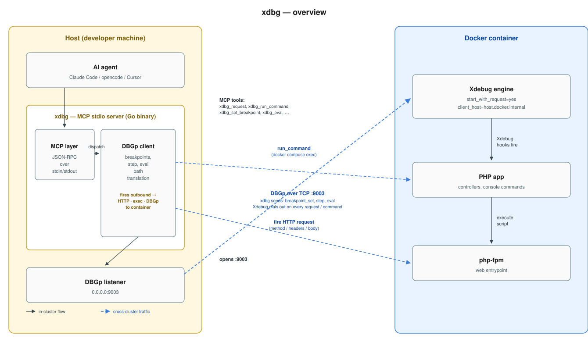

# xdbg — let AI debug your PHP, live in Docker

You run PHP in Docker. A bug shows up in an API endpoint — a POST with a JSON
body and an `Authorization: Bearer …` header. You open PhpStorm, click
"listen for debug connections", fire a request from Postman, hit the
breakpoint, step, inspect, eval, fix. Now imagine doing all of that **without
leaving the chat** — you describe the bug to Claude Code, opencode, Cursor, or
any MCP-aware agent, and the agent debugs it for you: sets the breakpoint,
fires the real request, reads the stack, inspects variables, steps, evals,
proposes a fix. That's xdbg.

**xdbg is an MCP server that connects to Xdebug running in a Docker container
and exposes it as tools** — so any AI agent that speaks MCP (Claude Code,
opencode, Cursor) can fire HTTP requests (`curl`-style) and run CLI commands
inside the container, then drive the resulting debug session: breakpoints,
stack, variables, eval, stepping. All from the chat.


## Why not PhpStorm's MCP tools?

PhpStorm ships its own Xdebug MCP tools, but they only fire **GET** requests
and don't let you set **headers** (cookies, auth tokens, `Content-Type`). For
real API work — POST/PUT/PATCH with JSON bodies and JWT/auth headers — you end
up juggling port forwards and a second terminal. xdbg closes that gap: the
same MCP-driven flow, but with full control over method, headers, and body,
plus CLI/Symfony command debugging and host↔container path translation.

## What it solves

| Pain | Before | With xdbg |
|---|---|---|
| **AI can't debug POST/PUT/PATCH** | PhpStorm MCP = GET only | `xdbg_request` takes `method`, `headers`, `body` |
| **Auth / cookies / JWT** | Nowhere to put the header | Pass `headers: {"Authorization": "Bearer …"}` (or read from a file to keep secrets out of the chat) |
| **CLI / Symfony commands** | No MCP path at all | `xdbg_run_command "bin/console app:foo"` pauses at the breakpoint |
| **Host ↔ container paths** | Breakpoints need container paths; stacks show container paths | Set breakpoints with host paths; stacks come back as host paths |
| **Port conflicts** | Two debuggers fight over 9003 | Detects the holder (lsof), waits up to 10 s for its turn, then tells you who's blocking |
| **Port 9003 always busy** | Debugger holds the port all session | Binds only during a tool call (`xdbg_request`, `xdbg_run_command`, `xdbg_listen`); releases immediately after — PhpStorm, browser Xdebug, and other tools work freely between calls |

## How it works (30-second version)

1. The container's Xdebug is a DBGp *engine*. With
   `xdebug.start_with_request=yes` it dials **out** to
   `host.docker.internal:9003` on every request and waits for commands.
2. `xdbg` listens on `0.0.0.0:9003` and drives the engine — set breakpoints,
   step, eval, read the stack.
3. The MCP server is one long-lived process, so the session survives across
   tool calls. Your agent sets a breakpoint, fires the request, inspects
   variables, steps — all in one conversation.
4. The DBGp port is **ephemeral** — bound only during a tool call and released
   as soon as Xdebug connects, so the port is free again while the session is
   still being driven. Between calls, port 9003 is free for PhpStorm, browser
   Xdebug, or any other debugger.

DBGp packets have a maximum payload length of 64 MiB and must end with NUL.
If a packet has an invalid length or terminator, xdbg closes the engine
connection and returns an error.

DBGp `<error>` responses return MCP tool results with `isError: true` and text `<command> error <code>: <message>`.
The engine connection stays open after an engine error.
Feature negotiation, `stop`, `detach`, and breakpoint cleanup with `breakpoint_clear` remain best-effort operations.



(Hand-drawn SVG — edit `docs/xdbg-overview.svg` directly if you need
to tweak layout.)

For the full request round-trip with step-by-step sequence, see the
[architecture diagram](docs/xdbg-architecture.svg) ([source](docs/architecture.puml)).

## Install

> **The fastest way:** paste this into your chat with Claude Code or opencode:
>
> ```
> Install and configure this MCP server for me: https://raw.githubusercontent.com/crazy-goat/xdbg/main/install.md
> ```
>
> The agent will read the guide and walk you through every step.
>
> xdbg also ships a **dedicated AI skill** (`skills/xdbg/SKILL.md`)
> that gives the agent context on debugging workflows, failure recovery, and best
> practices — making adoption smoother. The agent will ask you before installing it.
>
> Full guide: [install.md](install.md)

### `go install` (recommended — one line, no clone)

```bash
go install github.com/crazy-goat/xdbg@latest
```

> **Note:** `proxy.golang.org` caches versions for a few minutes. If the
> command fails with a module-path mismatch, install the latest commit directly:
> ```bash
> GOPROXY=direct go install github.com/crazy-goat/xdbg@main
> ```

This puts `xdbg` in `$(go env GOPATH)/bin` (default `~/go/bin`).
Add it to your `PATH` (one-time):

```bash
export PATH="$(go env GOPATH)/bin:$PATH"   # add to ~/.zshrc / ~/.bashrc
```

Verify: `xdbg --help`.

### From a local clone

```bash
git clone https://github.com/crazy-goat/xdbg.git
cd xdbg
make install          # builds and copies to ~/.local/bin/xdbg
```

(`make build` produces `./xdbg` without installing.)

### Prerequisites

- Go 1.26+ (only needed for `go install` / `make`)
- Docker (or any container runtime) running your PHP app
- Xdebug installed **inside** the container (the engine), enabled on demand

## Configure

xdbg is an MCP **stdio** server: the agent spawns it as a child process and
talks JSON-RPC over stdin/stdout. You register it once in your agent's MCP
config.

### opencode

Add an entry under `mcp` in `~/.config/opencode/opencode.json` (or your
project's `opencode.json`):

```jsonc
{
  "mcp": {
    "xdbg": {
      "enabled": true,
      "type": "local",
      "command": [
        "xdbg", "mcp",
        "--dbg-port", "9003",
        "--local-root",  "/Users/you/work/your-app",
        "--docker-root", "/var/www/your-app",
        "--xdebug-enable-cmd",  "docker compose exec -T php set-xdebug-on",
        "--xdebug-disable-cmd", "docker compose exec -T php set-xdebug-off",
        "--xdebug-status-cmd",  "docker compose exec -T php get-xdebug-status",
        "--container-exec",      "docker compose exec -T php"
      ]
    }
  }
}
```

Restart opencode (or reconnect MCP). Tools appear as `xdbg_*`.

### Claude Code (`.mcp.json`)

Drop a `.mcp.json` in your project root (or `~/.claude.json` for global):

```json
{
  "mcpServers": {
    "xdbg": {
      "command": "xdbg",
      "args": [
        "mcp",
        "--dbg-port", "9003",
        "--local-root",  "/Users/you/work/your-app",
        "--docker-root", "/var/www/your-app",
        "--xdebug-enable-cmd",  "docker compose exec -T php set-xdebug-on",
        "--xdebug-disable-cmd", "docker compose exec -T php set-xdebug-off",
        "--xdebug-status-cmd",  "docker compose exec -T php get-xdebug-status",
        "--container-exec",      "docker compose exec -T php"
      ]
    }
  }
}
```

Reconnect MCP in Claude Code. Tools appear as `mcp__xdbg__*`.

### Flags reference

| Flag | Default | Purpose |
|---|---|---|
| `--dbg-port` | `9003` | Port Xdebug dials into (the listener binds `0.0.0.0:<port>`) |
| `--local-root` | — | Host project root (for path translation) |
| `--docker-root` | `""` (empty) | Container project root; empty disables path translation (host and container paths are the same) |
| `--xdebug-enable-cmd` | — | Shell command to enable Xdebug in the container |
| `--xdebug-disable-cmd` | — | Shell command to disable Xdebug in the container |
| `--xdebug-status-cmd` | — | Shell command to check Xdebug status in the container |
| `--container-exec` | `docker compose exec -T php` | Prefix for running CLI commands inside the container |

### Path translation

The default empty `--docker-root` means that host and container paths are the same.
Relative breakpoint paths resolve under `--local-root`, which defaults to the current directory.
For example, with local root `/home/dev/app`, `src/Foo.php` becomes `/home/dev/app/src/Foo.php`.
Absolute breakpoint paths stay unchanged.
Engine paths also stay unchanged after xdbg removes `file://` and decodes URI percent escapes.

Breakpoint paths support spaces and non-ASCII characters.
Pass the original path, for example `my dir/a b.php`; do not percent-encode it.
xdbg encodes file URIs for DBGp and decodes engine file URIs for host locations and stacks.
Plain paths retain literal percent sequences, so a filename such as `literal%20.php` stays unchanged.

With a non-empty `--docker-root`, xdbg translates only the root itself and paths inside it.
For example, local root `/home/dev/app` does not match `/home/dev/application/x.php`.
xdbg uses POSIX path rules to clean roots and input paths before root comparisons and suffix extraction.
The root `/` remains valid.
Paths that do not need translation retain their original spelling.

When roots are nested, the more specific root takes precedence for absolute breakpoint paths.
A match on the local root translates to the Docker root; a match on the Docker root stays unchanged.
For example, local `/var/www/app` and Docker `/var/www` translate `/var/www/app/src/A.php` to `/var/www/src/A.php`.
For the reverse nesting, paths already under the Docker root stay unchanged.
Use a project-relative breakpoint path if an absolute path can refer to either root.
Engine paths always translate from the Docker root to the local root.

### Let the agent toggle Xdebug for you

Xdebug should be off by default for performance. When you configure
`--xdebug-enable-cmd`, `--xdebug-disable-cmd` and `--xdebug-status-cmd`, the
agent gets three MCP tools — `xdbg_container_enable`, `xdbg_container_disable`
and `xdbg_container_status` — and can turn Xdebug on only for the debug
session, then off again when it's done. No shell access, no manual steps —
the agent handles the full lifecycle itself.

## Tools (`xdbg_*`)

The server registers short tool names (`status`, `set_breakpoint`, …). The MCP
client adds a prefix: opencode shows `xdbg_status`, Claude Code shows
`mcp__xdbg__status`. This README uses the opencode names; the skill in
`skills/xdbg/SKILL.md` uses the short names.

### `xdbg_status()`
Returns the current debugger state (`no session`, `started`, `break`,
`stopping`), the file and line where execution is paused (or `-` when not
paused), and the number of breakpoints xdbg knows (queued and applied). The reply
has three lines: `state=…`, `location=…`, `breakpoints=N`. Use it as the first call
after firing a request or running a command to see whether the session was
adopted and where the engine stopped. It's safe to call any time, with or
without an active session. It does not advance execution or mutate state.

### `xdbg_set_breakpoint(string file, int line)`
`file` is a host path (absolute or project-relative, auto-translated to the
container path); `line` is 1-based. Sets a line breakpoint. If a session is
already active, the breakpoint is applied immediately and its engine-assigned
id is returned. If no session is active, the breakpoint is queued and applied
automatically on the next session (the next `xdbg_request` or
`xdbg_run_command`). Multiple breakpoints can be set before triggering the
request; xdbg sends them to the engine when it connects.
The queued reply includes a stable local handle, such as `q1`, `q2`, or `q3`.
Use this handle to remove the breakpoint without an active session.
The handle stays the same across sessions and xdbg does not reuse it in the same process.
If the engine rejects a live breakpoint, the tool returns an error and does not store it.
If the engine rejects a queued breakpoint, xdbg logs the rejection to stderr and marks it as `rejected`.

### `xdbg_breakpoint_list()`
Lists all breakpoints known to the engine, with their ids, state
(`enabled`/`disabled`), host path, and line.
With an active session, it also lists queued breakpoints that have no engine id.
When no session is active, it lists the local queue instead.
Queued entries appear as `queued <handle> <file>:<line>`, for example `queued q1 /home/dev/app/src/Foo.php:10`.
An empty list returns `(none)`.
Use it to check breakpoints before a request. Safe to call any time.
Rejected queued breakpoints appear as `rejected <handle> <file>:<line>: <error>` with or without an active session.

### `xdbg_breakpoint_remove(string id)`
`id` is an engine id or a local handle from `xdbg_set_breakpoint` or `xdbg_breakpoint_list`.
To remove a queued or rejected breakpoint without a session, pass its handle, for example `{id:"q1"}`.
The handle also works after xdbg applies the breakpoint to an engine.
With an active session, xdbg removes an applied breakpoint from the engine before it removes the local entry.
If the engine call fails, the tool returns an error and keeps the local entry.
Without an active session, xdbg removes a known breakpoint only from the local queue.
The tool rejects an empty id without a state change.
Engine ids must contain only ASCII digits; known local handles such as `q1` remain valid.
An unknown numeric id goes to the engine if a session is active; otherwise, it returns an error.
Returns `removed <id>` on success. Call `xdbg_breakpoint_list` first to find the id or handle.

### `xdbg_breakpoint_clear()`
Removes every breakpoint: queued (not yet applied) and applied (active in
the engine). Safe to call with or without an active session. Use it to reset
state between debugging scenarios. Returns the number of breakpoints cleared.
An invalid engine id returns an error before xdbg clears the local queue.

### `xdbg_request(string url, string? method, map<string,string>? headers, string? body, int? timeoutMs)`
`url` is required; `method` defaults to `GET`; `headers` is an object of
string→string; `body` is a raw string; `timeoutMs` defaults to 15000. Fires
an HTTP request at the app with full control over method, headers, and body.
Because the container has `xdebug.start_with_request=yes`, the request makes
php-fpm dial the DBGp port; xdbg adopts the connection, applies queued
breakpoints, and pauses at the first break. When no breakpoints are set, the
script runs to completion and the request returns. To debug interactively,
set breakpoints first, then call `xdbg_request` — the tool returns once the
session is paused, and you drive it with `xdbg_run` / `xdbg_step_*` / etc.
A `Host` header sets the request Host, regardless of case, without a change to the destination URL.
HTTP client errors return immediately as `request failed: <error>` instead of an Xdebug connection timeout.

### `xdbg_request_from_files(string url, string? method, string? headers_file, string? body_file, int? timeoutMs)`
`url` is required. `headers_file` is a path to a JSON object with string values
(one line or multiple lines), or a file with `Name: Value` lines.
The line format ignores blank lines and lines that start with `#`.
Header names in the line format must use RFC 7230 token characters; empty or invalid names return an error with the line number.
`body_file` is a path to raw body bytes; `timeoutMs` defaults to 15000.
Like `xdbg_request`, this tool supports a `Host` override and returns HTTP client errors immediately.
It reads headers and body from disk once, at call time.
Use files to keep sensitive header values (JWT tokens, cookies, API keys) out of the chat and tool arguments.

### `xdbg_listen(int? timeoutMs)`
`timeoutMs` defaults to 30000. Arms the DBGp listener and blocks until the
next engine connection is adopted, then returns. Use it for CLI / Symfony
command debugging: call `xdbg_listen` first, then launch the command
separately (e.g. `docker compose exec -T php php bin/console app:cmd`). Once
the tool returns, the session is paused at the script start with breakpoints
applied — drive it with `xdbg_run` / `xdbg_step_*` / etc. If no engine
connects within the timeout, returns an error. Once Xdebug connects, the DBGp
handshake has its own 10s deadline; if it does not finish, the connection is
dropped and the session is left with no session, so a later `xdbg_listen`
works instead of failing with "debug session already active".

### `xdbg_run_command(string command, int? timeoutMs)`
`command` is required (e.g. `"bin/console app:my-command --option=value"`);
`timeoutMs` defaults to 30000. Runs the command inside the container (prefixed
with `--container-exec`) and waits for the resulting Xdebug connection. When
no breakpoints are set, the script runs to completion and the command output
is returned. When breakpoints are set, the session pauses at the first break
and the caller drives it with `xdbg_run` / `xdbg_step_*` — the command output
is not available until the script finishes. If the command exits before Xdebug
connects (a bad service, a typo, or Xdebug off in the container), it returns
promptly with the command output and exit status instead of waiting for
`timeoutMs`. This is the CLI equivalent of `xdbg_request`.

### `xdbg_run()`
Resumes execution after a break — the engine runs until the next breakpoint
or until the script finishes. Returns the new state (`break`/`stopping`) and
the current location. When the script finishes, the state becomes `stopping`
and the response notes `(script finished)`. Call it repeatedly to step
through breakpoints.

### `xdbg_step_into()`
Steps into the next line — if the next line is a function call, execution
pauses at the first line inside the called function. Returns the new state
and location. Use it to follow execution into callees. When there's nothing
to step into, behaves like `xdbg_step_over`.

### `xdbg_step_over()`
Steps over the next line — if the line is a function call, the function runs
to completion and execution pauses on the next line of the caller. Returns
the new state and location. Use it to advance without descending into
callees.

### `xdbg_step_out()`
Steps out of the current function — execution runs until the current
function returns, then pauses at the caller. Returns the new state and
location. Use it to escape a function you stepped into by mistake.

### `xdbg_pause()`
Breaks (pauses) execution immediately, as if a breakpoint were hit at the
current line. Returns the new state (`break`) and location. Use it to
interrupt a long-running `xdbg_run` and regain control. Only meaningful while
a session is active and running.

### `xdbg_stack()`
Returns the call stack at the current pause point, with each frame's depth,
function name, file (translated to a host path) and line. Returns the error `no active session` when there is no session, and `(no stack — not paused?)` when the session is not at a break (for example right after `xdbg_request` returns at the script start). Use it to understand
how you got to the current location. Safe to call any time, but only
meaningful while paused.

### `xdbg_context(int? stackDepth)`
`stackDepth` defaults to 0 (the top frame). Returns the variables in scope
at the given stack frame, with their names, types, and a summarized value.
Use it to inspect the local state at the current pause point. For nested
values, the summary shows the type and child count (e.g.
`object {3 children}`) — use `xdbg_property_get` to drill in.

### `xdbg_eval(string expression)`
`expression` is a PHP expression (e.g. `$foo->bar()` or `count($items)`).
Evaluates the expression in the current scope and returns the result. Use it
to test hypotheses, call methods, inspect computed values, or probe framework
state. The expression is base64-encoded and sent via the DBGp `eval` command.
Returns an error if the expression throws.

### `xdbg_property_get(string name, int? stackDepth)`
`name` is a variable name (e.g. `$foo`); `stackDepth` defaults to 0. Returns
the value of one variable or property in the given stack frame. Use it to
drill into a variable you saw in `xdbg_context` — for nested structures, it
returns the child properties. Returns `(not found)` only when the engine returns no property and no error.
An engine error, including code 300 for a missing property, returns an error result.
Property names support spaces, quotes, backslashes, and non-ASCII characters, for example `$arr['a b']` or `$arr["k"]`.
Pass the original name; xdbg quotes and escapes it for DBGp.
A name with a NUL byte returns `name must not contain NUL` without an engine command.

### `xdbg_property_set(string name, string value)`
`name` is a variable name; `value` is a PHP literal (e.g. `"bar"` or `42`).
Sets the variable to the given value in the current scope. Use it to test how
the code behaves with different inputs without editing the source. The value
is base64-encoded and sent via the DBGp `property_set` command. Returns
`<name> = <value>` on success.
An engine `<error>` response or `success="0"` returns an error result instead.
Property names have the same support and NUL restriction as `xdbg_property_get`.
For example, `{name:"$arr['a b']", value:"99"}` changes the array entry with the key `a b`.

### `xdbg_detach()`
Detaches from the engine: lets the script finish on its own and drops the
session. xdbg closes the DBGp connection (the listener on port 9003 already closed when Xdebug connected). Use it when you're done
debugging but want the request/command to complete normally. Returns
`detached`.

### `xdbg_stop()`
Stops the debugged script immediately — the engine terminates the PHP
process and the session ends. xdbg closes the DBGp connection. Use it
to abort a stuck request or command. Returns `stopped`.

### `xdbg_container_status()` / `xdbg_container_enable()` / `xdbg_container_disable()`
No arguments. Available only when the corresponding `--xdebug-*-cmd` flag is
configured. `_status` runs the status command and returns its output (e.g.
whether Xdebug is currently on or off). `_enable` / `_disable` run the
enable/disable commands to toggle Xdebug in the container at runtime, so the
agent can turn it on for a debug session and off again afterwards without
shell access.

## Typical flows

**Web (POST/GET/…)** — the tool fires the request itself:

1. `xdbg_container_status` — check Xdebug is enabled in the container
2. `xdbg_container_enable` — turn it on if it's off
3. `xdbg_set_breakpoint` `{file:"src/.../FooController.php", line:42}`
4. `xdbg_request` `{url:"http://127.0.0.1:8090/api/foo", method:"POST", headers:{"Content-Type":"application/json","Authorization":"Bearer …"}, body:"{…}"}` → breaks at `FooController:42`
5. `xdbg_stack` / `_context` / `_eval` / `_step_*` / `_run` — inspect and step
6. `xdbg_detach` or `xdbg_stop` — end the session and free port 9003
7. `xdbg_container_disable` — turn Xdebug off (restore container performance)

**CLI / Symfony command (manual launch):**

1. `xdbg_container_status` — check Xdebug is enabled in the container
2. `xdbg_container_enable` — turn it on if it's off
3. `xdbg_set_breakpoint` …
4. `xdbg_listen` (arms; returns when the engine connects)
5. launch separately: `docker compose exec -T php php bin/console app:cmd`
6. drive with `_run` / `_step_*` / `_stack` / `_context` / `_eval`
7. `xdbg_detach` or `xdbg_stop` — end the session and free port 9003
8. `xdbg_container_disable` — turn Xdebug off (restore container performance)

**CLI / Symfony command (agent-driven):**

1. `xdbg_container_status` — check Xdebug is enabled in the container
2. `xdbg_container_enable` — turn it on if it's off
3. `xdbg_set_breakpoint` …
4. `xdbg_run_command` `{command:"bin/console app:my-command --option=value"}` → pauses at the breakpoint
5. `xdbg_stack` / `_context` / `_eval` / `_step_*` / `_run` — inspect and step
6. `xdbg_detach` or `xdbg_stop` — end the session and free port 9003
7. `xdbg_container_disable` — turn Xdebug off (restore container performance)

## Contributing

The development and release process is described in [docs/workflow.md](docs/workflow.md) and [docs/release-workflow.md](docs/release-workflow.md). Project commands are in [AGENTS.md](AGENTS.md).

## License

MIT — see [LICENSE](LICENSE).